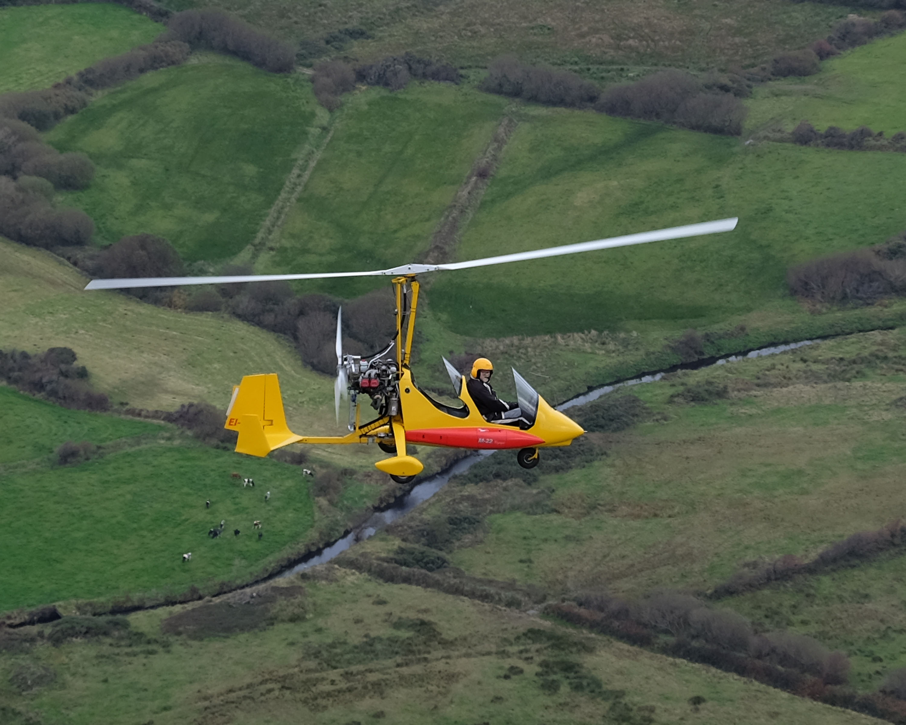

# irishgyroplanes.com
No special software is needed to edit it — just plain HTML pages and image folders.

## Preview on your computer

1. Open the project folder.
2. Double-click `index.html` to open it in your browser.
3. Or right-click → Open with → Chrome / Edge / Firefox.

## How the site is organised

| File / folder | What it is |
|---|---|
| `index.html` | Home page |
| `about.html` | About / how to get started |
| `photos.html` | Photo galleries |
| `video.html` | YouTube videos |
| `airfield.html` | Spanish Point airfield |
| `media.html` | Gyros in film & TV |
| `training.html` | Training info |
| `contact.html` | Email contact |
| `css/style.css` | Look and layout (colours, fonts, spacing) |
| `js/site.js` | Menu button + click-to-enlarge photos |
| `images/` | All pictures |

## How to edit text

1. Open the page you want (for example `about.html`) in Notepad, or better: [VS Code](https://code.visualstudio.com/) / Cursor.
2. Change the words between the tags — for example the text inside `<p>...</p>` or `<h1>...</h1>`.
3. Save the file.
4. Refresh the page in your browser.

## How to add a photo

1. Put the new image file into the right folder, for example:
   - `images/photos/irish-gyroplanes/`
2. Open `photos.html`.
3. Copy an existing photo line, for example:

```html
<a href="images/photos/irish-gyroplanes/01-west-clare.jpg" data-lightbox>
  
</a>
```

4. Change the filename in **both** places to your new file name.
5. Save and refresh.

## How to add a YouTube video

1. Open `video.html`.
2. Copy one of the `<article class="video-card">...</article>` blocks.
3. Replace the YouTube ID in the `src` (the bit after `/embed/`).
4. Update the title text under the video.
5. Save and refresh.

Example: for `https://www.youtube.com/watch?v=ABC123xyz` the embed URL is:

```html
src="https://www.youtube.com/embed/ABC123xyz"
```

### Updating the live site

1. Edit files on your computer.
2. Commit and push to GitHub (or use GitHub’s website “Upload files”).
3. Cloudflare Pages redeploys automatically in a minute or two.

